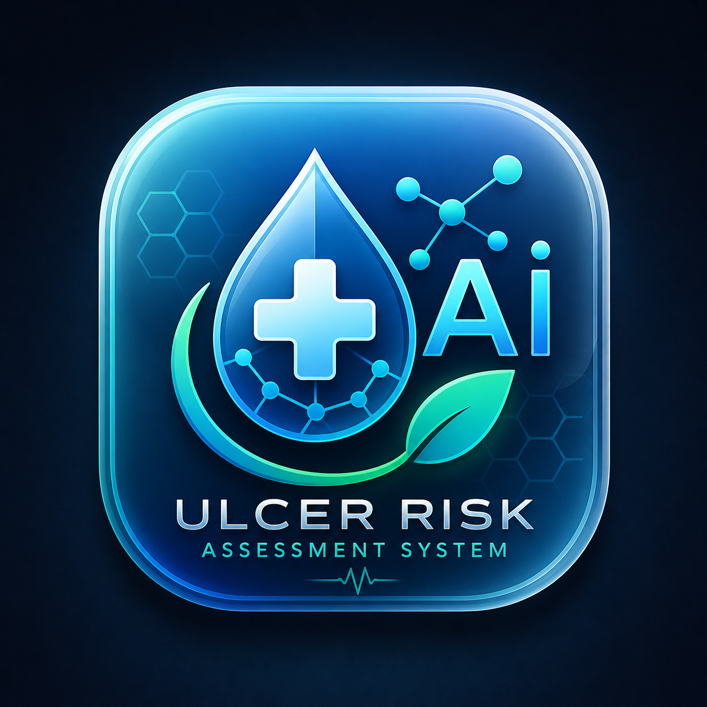

<div align="center">



# 🧬 Saliva-Based Ulcer Risk Assessment System
### *SURAS — AI-Powered Oral Health Prediction via Salivary Biomarker Analysis*

<br/>

[](https://python.org)
[](https://github.com)
[](https://github.com)
[](https://github.com)
[](https://pyinstaller.org)
[](LICENSE)

<br/>

> **A non-invasive, AI-driven desktop application that predicts oral ulcer risk by analyzing salivary biomarkers — enabling early detection before symptoms appear.**

<br/>

[📖 Overview](#-overview) • [⚙️ Algorithm](#️-swbra-algorithm) • [🚀 Getting Started](#-getting-started) • [📁 Structure](#-project-structure) • [🔮 Roadmap](#-future-roadmap) • [⚠️ Disclaimer](#️-disclaimer)

</div>

---

## 📖 Overview

Oral ulcers are painful, recurring conditions that significantly impact quality of life. Traditional diagnosis is **reactive** — it waits for visible symptoms. **SURAS changes this.**

By analyzing salivary biomarkers such as **IL-6**, **CRP**, **IgA**, and **pH levels**, SURAS generates a real-time ulcer risk score using a custom predictive algorithm — before symptoms manifest. It delivers this through a clean, standalone desktop application designed for clinical support and academic research.

### Why Saliva?
Saliva is an accessible, **non-invasive diagnostic medium** rich in immunological and biochemical signals. It requires no blood draw, no clinical procedure — just a sample.

---

## ✨ Key Features

| Feature | Description |
|---|---|
| 🖥️ **Desktop Application** | Standalone `.exe` — no installation of Python required for end users |
| 🧪 **Biomarker Analysis** | Processes IL-6, CRP, IgA, pH, and protein levels |
| 🤖 **ML Risk Prediction** | Trained machine learning model with real-time inference |
| 📊 **SWBRA Scoring** | Custom weighted algorithm for Low / Moderate / High classification |
| 🗄️ **Patient Database** | SQLite-backed storage for patient records and prediction history |
| 🔄 **Auto-Update Support** | Built-in updater module for version management |
| 📦 **Installer Ready** | Inno Setup `.exe` installer for easy distribution |

---

## ⚙️ SWBRA Algorithm

**Saliva Weighted Biomarker Risk Algorithm** — a rule-based scoring system grounded in clinical biomarker thresholds.

### Risk Contribution Weights

```
High IL-6 Level        →  +30 points   (Primary inflammatory marker)
High CRP Level         →  +25 points   (C-Reactive Protein elevation)
Low IgA Level          →  +20 points   (Reduced immunoglobulin A)
Abnormal Salivary pH   →  +15 points   (pH imbalance indicator)
```

### Risk Classification

```
┌─────────────────┬──────────────┬─────────────────────────────────────┐
│   Score Range   │  Risk Level  │            Recommendation           │
├─────────────────┼──────────────┼─────────────────────────────────────┤
│     0  – 39     │   🟢  LOW    │  Routine monitoring                 │
│    40  – 69     │ 🟡 MODERATE  │  Lifestyle adjustment advised       │
│    70  – 90     │   🔴  HIGH   │  Clinical consultation recommended  │
└─────────────────┴──────────────┴─────────────────────────────────────┘
```

---

## 🏗️ System Architecture

```
┌─────────────────────────────────────────────────────────────┐
│                     SURAS Desktop App                       │
├─────────────────────────────────────────────────────────────┤
│  Input Layer         │  Salivary biomarker data (CSV / PKL) │
│  Processing Engine   │  Data cleaning, feature engineering  │
│  ML Model            │  Trained classifier (train_model.py) │
│  Risk Engine         │  SWBRA scoring algorithm             │
│  Storage Layer       │  SQLite — patients.db                │
│  UI Layer            │  Desktop interface (main.py)         │
└─────────────────────────────────────────────────────────────┘
```

---

## 📁 Project Structure

```
Saliva-Based-Ulcer-Risk-Assessment-System/
│
├── 📂 assets/                  # App icons and splash screen
│   ├── app.ico
│   └── splash.png
│
├── 📂 installer/               # Inno Setup installer script
│   └── setup.iss
│
├── 📂 snap/                    # Development snapshots
│   └── main copy.py
│
├── 📂 src/                     # Dataset files
│   ├── data.csv
│   └── data.pkl
│
├── 📂 User_data/               # Runtime patient database
│   └── patients.db
│
├── backend.py                  # Core prediction & processing logic
├── main.py                     # Application entry point
├── train_model.py              # ML model training script
├── updater.py                  # Auto-update module
├── secret_key.py               # Key management
├── file_structure.py           # Directory setup utility
├── UlcerRiskAI.spec            # PyInstaller build spec
├── UlcerRiskAI_Setup.iss       # Inno Setup configuration
├── BUILD_GUIDE.md              # Build instructions
├── requirements.txt            # Python dependencies
├── version_info.txt            # Version metadata
└── README.md
```

---

## 🚀 Getting Started

### Prerequisites

- Python 3.10 or higher
- pip (Python package manager)
- Windows OS (for `.exe` build)

### 1. Clone the Repository

```bash
git clone https://github.com/your-username/Saliva-Based-Ulcer-Risk-Assessment-System.git
cd Saliva-Based-Ulcer-Risk-Assessment-System
```

### 2. Install Dependencies

```bash
pip install -r requirements.txt
```

### 3. Train the Model

```bash
python train_model.py
```

### 4. Run the Application

```bash
python main.py
```

---

## 📦 Build & Distribution

### Build Standalone EXE (PyInstaller)

```bash
pyinstaller UlcerRiskAI.spec
```

Output executable:

```
dist/
└── UlcerRiskAI.exe
```

### Create Installer (Inno Setup)

1. Open `UlcerRiskAI_Setup.iss` in [Inno Setup](https://jrsoftware.org/isinfo.php)
2. Click **Compile**
3. Distribute the generated `.exe` installer

---

## 🗄️ Database

Patient data is stored locally in:

```
User_data/patients.db    (SQLite)
```

**Stored records include:**
- Patient demographics and identifiers
- Biomarker input values
- SWBRA risk scores
- Prediction timestamps and history

---

## 🔬 Methodology

```
1. Data Collection         →  Salivary biomarker dataset (CSV format)
2. Data Preprocessing      →  Null handling, normalization, outlier removal
3. Feature Engineering     →  Biomarker threshold derivation
4. Model Training          →  ML classifier (train_model.py)
5. Risk Scoring            →  SWBRA weighted algorithm
6. Deployment              →  PyInstaller EXE + Inno Setup installer
```

---

## 🎯 Applications

- 🏥 **Clinical Decision Support** — Assist practitioners in early risk identification
- 🔬 **Academic Research** — Biomarker correlation and predictive modeling studies
- 📡 **Preventive Healthcare** — Monitor at-risk populations proactively
- 🧑‍🎓 **Final Year Projects** — Reference implementation for biomedical AI systems

---

## 🔮 Future Roadmap

- [ ] 📱 Mobile application (Android / iOS)
- [ ] 🌐 Cloud sync and web dashboard
- [ ] 🔌 IoT saliva sensor integration (ESP8266 / ESP32)
- [ ] 🧠 Explainable AI (XAI) — SHAP-based feature explanations
- [ ] 📡 Real-time continuous monitoring system
- [ ] 🌍 Multi-language UI support

---

## 📋 Requirements

Key dependencies (see `requirements.txt` for full list):

```
scikit-learn
pandas
numpy
sqlite3 (built-in)
tkinter (built-in)
pyinstaller
joblib
```

---

## 👨‍💻 Author

**Harisudhan**
Final Year Project — AI-Based Healthcare System
*B.Tech / B.E. in Computer Science / Artificial Intelligence*

---

## 📜 License

This project is intended for **academic and research purposes only**.
Not licensed for commercial use or clinical deployment without further validation.

---

## ⚠️ Disclaimer

> This system is a **research prototype** developed as an academic project.
> It has **not been clinically validated** and must **not** be used as a substitute for professional medical diagnosis, advice, or treatment.
> Always consult a qualified healthcare professional for medical decisions.

---

<div align="center">

**⭐ If this project helped you, consider giving it a star!**

*Built with ❤️ for the intersection of AI and Healthcare*

</div>